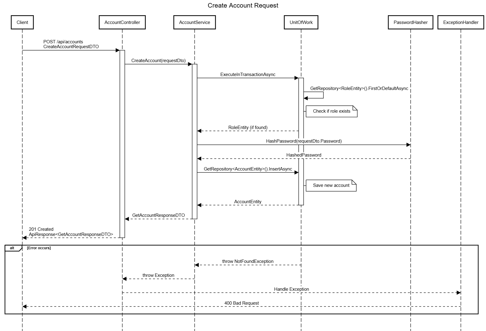

# CS-Base-Project

This is the repository where I can learn how to design a base project for my future project.

## 📌 Table of Contents

- [Features](#features)
- [Tech Stack](#tech-stack)
- [Getting Started](#getting-started)
- [Running the Application](#running-the-application)
- [API Endpoints](#api-endpoints)
- [Contributing](#contributing)
- [License](#license)

## 🚀 Features

- Log in.
- CRUD an Account.
- View roles.

## 🛠️ Tech Stack

- ASP.NET Core 9
- Entity Framework Core
- PostgreSQL
- Swagger / Swashbuckle
- AutoMapper

## 🧑‍💻 Getting Started

### Prerequisites

- [.NET SDK](https://dotnet.microsoft.com/en-us/download) (version X.X+)
- Visual Studio / VS Code
- SQL Server (or your DB of choice)

### Clone the repository

```bash
git clone https://github.com/yourusername/your-repo-name.git
cd your-repo-name
```
### Before running
 - Make sure to create a database on your PostgreSQL database.
 - Change your database connection string in appsettings.json.

### Run
 - For simplification, run this project on your favorite IDE.

## 🔀 Workflow
 
 - This is the workflow for creating an Account.


## 📁 Project Structures

This project uses a three-layer architecture: 
 - API: this layer registers controllers, and applies basic configuration for the app.
 - BLL: this layer is responsible for the logic of an app.
 - DAL: this layer contains class data and handles the interaction with the database.

Design Patterns applied: 
 - Repository Pattern.
 - Generic Repository Pattern.
 - Unit of Work Pattern.
